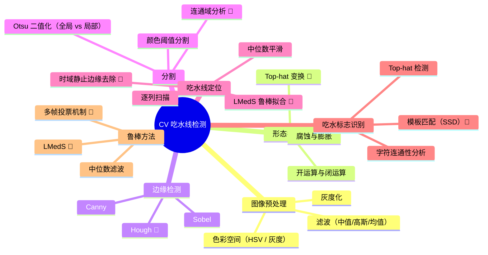

# 📚 个人知识库

> 每次读文献自动更新。记录「已掌握 ✅」和「待学习 🔴」的知识点。

## 一、知识图谱



## 二、掌握进度

### 🟢 已掌握

| 知识点 | 首次接触 | 来源文献 | 掌握程度 |
|--------|----------|----------|----------|
| Canny 边缘检测 | 2026-05-31 | 彭将辉论文 / Tsujii2016 | ⭐⭐⭐ 能独立实现 |
| Sobel 算子 | 2026-05-31 | 彭将辉论文 | ⭐⭐⭐ 能独立实现 |
| 中值滤波 | 2026-05-31 | 彭将辉论文 / Tsujii2016 | ⭐⭐⭐ 能独立实现 |
| HSV 色彩空间 | 2026-05-31 | 彭将辉论文 | ⭐⭐⭐ 能独立实现 |
| 卷积核原理 | 2026-05-31 | - | ⭐⭐ 理解概念 |
| 非极大值抑制 NMS | 2026-05-31 | - | ⭐⭐ 理解概念 |

### 🟡 学习中

| 知识点 | 开始时间 | 计划掌握日期 | 当前进度 |
|--------|----------|-------------|----------|
| Otsu 二值化 | 2026-05-31 | 待定 | ⭐ 需学习 |
| 腐蚀与膨胀 | 2026-05-31 | 待定 | ⭐ 需学习 |

### 🔴 待学习（按优先级排序）

| 优先级 | 知识点 | 为什么需要 | 计划学习时间 | 推荐资源 |
|--------|--------|-----------|-------------|----------|
| P0 | **Top-hat 变换** | Tsujii2016 核心方法，检测吃水标志 | - | B站搜"形态学操作" |
| P0 | **LMedS 鲁棒估计** | Tsujii2016 水线拟合方法，比最小二乘法好 | - | YouTube 搜"LMedS robust estimation" |
| P0 | **形态学开闭运算** | Top-hat 的基础，也是你的项目需要的 | - | OpenCV 官方教程 |
| P1 | **Otsu 二值化（局部）** | Tsujii2016 分割吃水标志的方法 | - | B站搜"大津法 Otsu" |
| P1 | **模板匹配 SSD** | Tsujii2016 识别吃水标志数字 | - | OpenCV template matching 教程 |
| P1 | **时域静止边缘去除** | Tsujii2016 核心创新点，多帧去噪 | - | 理解论文公式(5)(6)(7) |
| P1 | 连通域分析 | 过滤噪声块 | - | - |
| P1 | Hough 变换 | 直线检测辅助吃水线 | - | - |
| P2 | 标准差突变检测 | 彭将辉方法 | - | - |

## 三、已读文献

| 论文 | 日期 | 评级 | 核心收获 |
|------|------|------|---------|
| Tsujii2016 自动吃水线读取 | 2026-05-31 | ⭐⭐⭐⭐ | Top-hat + 局部 Otsu + Canny + LMedS 完整流程，<1cm 精度 |

## 四、知识关联图

```
吃水线检测
├── 图像采集 ← 摄像头/无人机选型
├── 预处理
│   ├── 中值滤波 ← 去噪
│   ├── HSV 转换 ← 颜色空间
│   └── 形态学运算 ← Tsujii 方法核心 [待学]
│       ├── 腐蚀/膨胀
│       ├── 开运算/闭运算
│       └── Top-hat 变换 [新！]
├── 船体/标志分割
│   ├── 颜色阈值分割（你的方法）
│   ├── 局部 Otsu 二值化 [Tsujii]
│   ├── Top-hat 检测 [Tsujii 新！]
│   └── 连通域过滤 [待学]
├── 吃水线定位
│   ├── 逐列扫描 + 中位数平滑（你的方法）
│   ├── Canny + 时域静止边缘去除 [Tsujii 新！]
│   ├── LMedS 鲁棒拟合 [Tsujii 新！]
│   └── 标准差突变法（彭将辉）
├── 吃水标志识别 [新领域！]
│   ├── 模板匹配 SSD
│   └── 字符连通性分析
└── 后续优化
    ├── 多帧融合 [Tsujii]
    └── 深度学习方法 [远期]
```

> 🔄 **迭代规则**：每次读新文献后自动更新此文件。旧知识从「待学习」移到「学习中」再移到「已掌握」。
